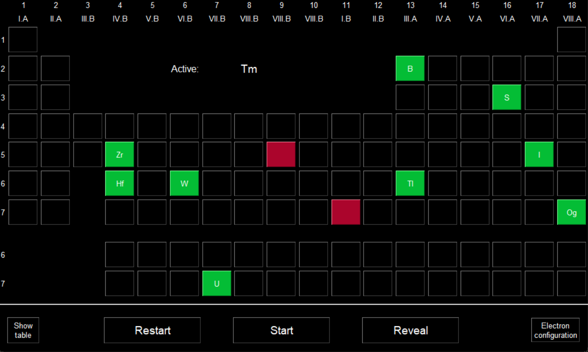
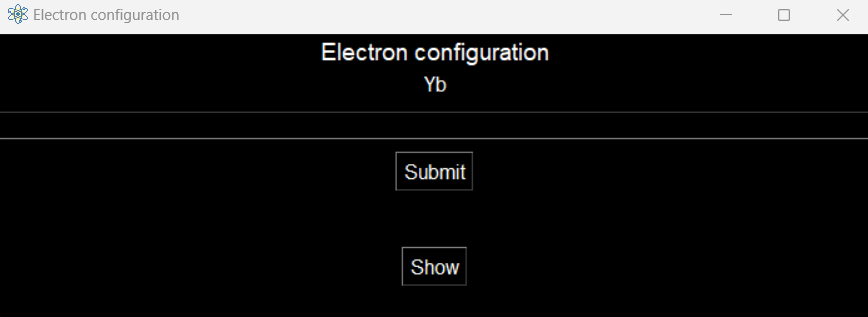

# Periodic table drill
This is a simple GUI application for practising positions of chemical elements in the periodic table and their electron configurations.

## Dependencies
There are no 3rd party dependencies.

## Functionality
The main objective is to fill the empty periodic table with chemical elements by placing them in the correct position. In case you are not sure where to put the element, you can reveal its correct location and continue. In each step, you can also reveal the whole table to see all the correct positions, which can help you learning.

Finally, you can enable "electron configuration" mode, in which you are prompted to enter the electron configuration for each inserted element.

